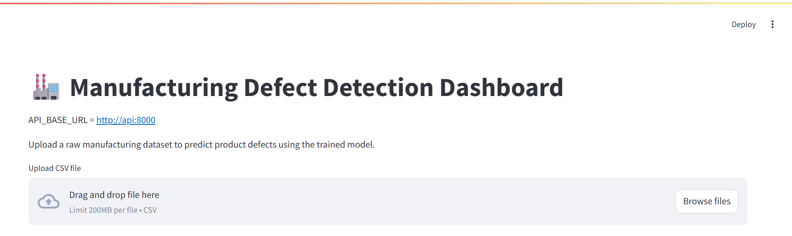
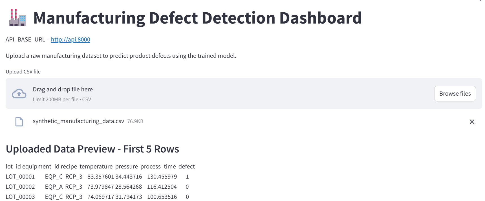
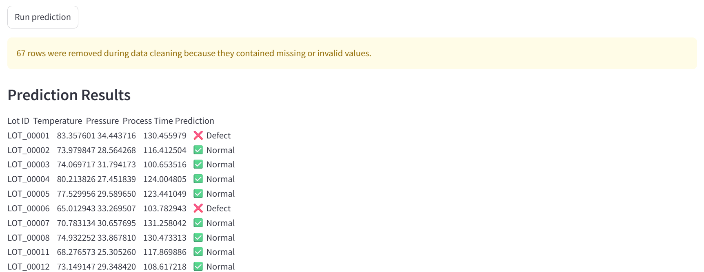

# Manufacturing Defect Detection

This project focuses on building an end-to-end production-style machine learning system 
rather than training a standalone model.

This project simulates a real-world industrial AI workflow, starting from raw manufacturing 
data and ending with an interactive prediction dashboard. The focus is not only on building 
a machine learning model, but also on designing a maintainable, modular, and 
production-like data pipeline.

## Project Overview

Manufacturing facilities continuously generate large amounts of process data from 
equipment and production lines. Identifying defective products early can reduce 
production costs, improve product quality, and minimize downtime.

This project demonstrates a complete defect detection workflow by:

- Generating synthetic manufacturing data
- Validating and preprocessing raw manufacturing CSV files
- Performing automated data cleaning and feature engineering
- Training a Gradient Boosting defect prediction model
- Serving predictions through a FastAPI backend
- Visualizing prediction results in an interactive Streamlit dashboard


## Features

- Generate synthetic manufacturing datasets
- Automated data cleaning pipeline
- Automated feature engineering pipeline
- Gradient Boosting defect prediction model
- Interactive Streamlit dashboard
- Raw CSV upload
- Automatic preprocessing
- Automatic prediction
- KPI summary cards
- Interactive Plotly visualizations
- Prediction result download
- CSV validation
- Friendly error handling
- Modular and reusable project structure

## Project Architecture
```text
            End User
                │
                ▼
        +-------------------+
        | Streamlit(Docker) |
        +-------------------+
                │
            HTTP POST
                │
                ▼
        +-------------------+
        |  FastAPI(Docker)  |
        +-------------------+
                │
                ▼
        +------------------+
        | Data Pipeline    |
        | - Validation     |
        | - Cleaning       |
        | - Feature Eng.   |
        +------------------+
                │
                ▼
        +------------------+
        | Gradient Boosting|
        +------------------+
                │
                ▼
        Prediction Results
                │
                ▼
            Streamlit UI
```

## Machine Learning Pipeline

1. Generate synthetic manufacturing data
2. Clean invalid and missing values
3. Create engineered features
4. Train Gradient Boosting classifier
5. Evaluate model performance
6. Save trained model
7. Predict defects on unseen data
8. Visualize prediction results

## Model Performance (Synthetic Dataset)
```text
┌──────────────┬────────────┐
|    Metric    |    Score   |
|──────────────|────────────|
| Accuracy     | 1.0000     |
| Precision    | 1.0000     |
| Recall       | 1.0000     |
| F1-score     | 1.0000     |
└──────────────┴────────────┘
```

## Model Performance
```text
┌───────────────────────┬─────────────────────────┐
|         Metric        |          Result         |
|───────────────────────|─────────────────────────|
| Test records          |  187                    |
| Total inference time  |  2.31 ms                |
| Average latency       |  0.0124 ms/record       |
| Throughput            |  80,972 records/second  |
└───────────────────────┴─────────────────────────┘
```
> **Note:** The synthetic dataset uses deterministic rule-based defect generation. 
> Therefore, near-perfect performance is expected and primarily demonstrates the 
> end-to-end  machine learning workflow rather than real-world predictive performance.

## Dashboard Features

The Streamlit dashboard provides:

- Upload raw manufacturing CSV files
- Automatic preprocessing
- Automatic feature engineering
- Defect prediction
- KPI summary cards
- Defect distribution pie chart
- Defect count bar chart
- Interactive prediction table
- Highlighted defect rows
- Download prediction results as CSV

## Tech Stack
    ┌─────────────────┬──────────────────────────────────┐
    │   Category      |           Technologies           |
    |─────────────────|──────────────────────────────────|
    |   Language      |             Python 3.11          |
    |   Backend       |              FastAPI             |
    |       ML        |  Scikit-learn, Gradient Boosting |
    |      Data       |            Pandas, NumPy         |
    |   Frontend      |          Streamlit, Plotly       |
    |      DevOps     |        Docker, Docker Compose    |
    | Version Control |             Git, GitHub          |
    └─────────────────┴──────────────────────────────────┘
## Project Structure
```text
    ManufacturingDefectDetection/
    │
    ├── dashboard/
    │   └── app.py                     # Streamlit dashboard
    │
    ├── data/
    │   ├── raw/                       # Raw manufacturing data
    │   └── processed/                 # Cleaned datasets
    │
    ├── images/                        # README screenshots
    │
    ├── models/
    │   ├── gradient_boosting_model.pkl
    │   └── feature_columns.pkl
    │
    ├── notebooks/                     # Experiments and EDA
    │
    ├── reports/                       # Evaluation reports
    │
    ├── src/
    │   ├── api.py                     # FastAPI inference service
    │   ├── data_generator.py          # Synthetic data generation
    │   ├── data_cleaning.py           # Data preprocessing
    │   ├── feature_engineering.py     # Feature engineering
    │   ├── train_model.py             # Model training
    │   ├── evaluate_model.py          # Model evaluation
    │   └── predict.py                 # Prediction utilities
    │
    ├── Dockerfile.api                 # FastAPI Docker image
    ├── Dockerfile.streamlit           # Streamlit Docker image
    ├── docker-compose.yml             # Multi-container configuration
    │
    ├── requirements.txt
    ├── README.md
    └── .gitignore
```

## Installation
### Clone the repository
```bash
git clone https://github.com/JK1030/ManufacturingDefectDetection.git
```

### Move into the project
```bash
cd ManufacturingDefectDetection
```

### Create a virtual environment
```bash
python -m venv .venv
```

### Activate the virtual environment
#### Windows
```bash
.venv\Scripts\activate
```

#### Install dependencies
The repository already includes the trained model in the models/ directory.
No additional training is required.
```bash
pip install -r requirements.txt
```

## Running the Project
### Local Execution
Launch the Streamlit dashboard locally.
```bash
streamlit run dashboard/app.py
```

### Docker Execution
Build the Docker images and start all services.
```bash
docker compose up --build
```

### Stop Docker Services
```bash
docker compose down
```

    The application will be available at:
        - **Streamlit Dashboard:** http://localhost:8501
        - **FastAPI:** http://localhost:8000
        - **FastAPI Docs (Swagger):** http://localhost:8000/docs

    Upload a raw manufacturing CSV file and the application will automatically:
        - Validate the CSV
        - Clean the data
        - Generate engineered features
        - Load the trained model
        - Predict manufacturing defects
        - Display interactive visualizations
        - Allow downloading prediction results

## Dashboard Preview

### Dashboard


#### Upload CSV


#### Prediction Results


## Future Improvements

- Deploy on AWS EC2
- CI/CD with GitHub Actions
- SHAP model explainability
- XGBoost / LightGBM comparison
- Model monitoring and logging
- Real-time prediction API

## Author

**Jenny Jinmyeong Kim**

Industrial AI | Machine Learning | Manufacturing Analytics | Data Engineering

GitHub: https://github.com/JK1030/ManufacturingDefectDetection

